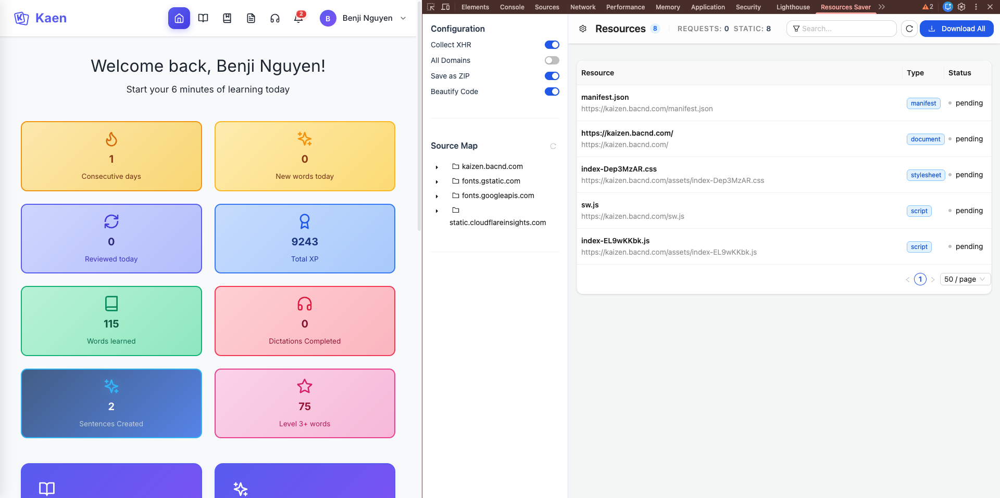
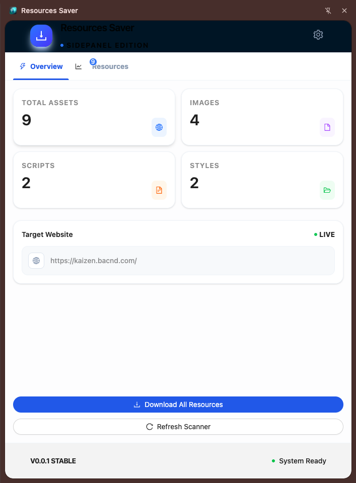

# 📦 Resources Saver

<div align="center">
  
  <p><i>The ultimate web asset extraction tool. Save everything while maintaining original folder structures.</i></p>
  
  [](https://opensource.org/licenses/MIT)
</div>

---

## 🌟 Overview

**Resources Saver** is a professional-grade browser extension built for developers, designers, and web enthusiasts. It provides a seamless way to extract all assets from any webpage—including images, stylesheets, scripts, and fonts—while **faithfully preserving the original directory hierarchy**.

Built with modern web technologies, it offers a high-performance, intuitive interface that lives right in your browser's side panel, making resource management easier than ever.

## ✨ Key Features

- 🚀 **Turbo Downloads**: High-speed extraction of all website resources with one click.
- 📂 **Directory Integrity**: Files are automatically organized into folders matching the source server structure.
- 🎨 **Premium Side Panel UI**: A sleek, modern interface built with **Ant Design** and **Tailwind CSS v4**.
- 🔍 **Live Code Preview**: View and inspect source code directly within the extension with syntax highlighting.
- 📦 **One-Tap ZIP Export**: Effortlessly package all extracted resources into a single, organized ZIP file.
- 📱 **QR & Markdown Integration**: Quick sharing via QR codes and a built-in Markdown editor for taking notes on the fly.
- 🌓 **Adaptive Dark Mode**: A beautiful, eye-friendly interface that respects your system settings.

## 🛠 Tech Stack

Resources Saver is built on a cutting-edge foundation:

- **Framework**: [WXT](https://wxt.dev/) (Web Extension Toolbox)
- **Core**: [React 19](https://react.dev/) & [TypeScript](https://www.typescriptlang.org/)
- **UI Components**: [Ant Design 6](https://ant.design/)
- **Styling**: [Tailwind CSS v4](https://tailwindcss.com/)
- **Utilities**: [JSZip](https://stuk.github.io/jszip/) (Compression), [Lucide](https://lucide.dev/) (Icons), [Highlight.js](https://highlightjs.org/) (Code Syntax)

## 🚀 Getting Started

### Installation

For users, the easiest way to get started is by installing from the **[Chrome Web Store](https://chrome.google.com/)**.

### For Developers

If you wish to build from source or contribute:

1. **Clone & Install**:

   ```bash
   git clone https://github.com/NortonBen/Resources-Saver.git
   cd Resources-Saver
   npm install
   ```

2. **Development Mode**:

   ```bash
   npm run dev
   ```

3. **Build for Production**:

   ```bash
   npm run build
   ```

## 📸 Interface Preview


*Seamless integration with Chrome DevTools for advanced resource tracking.*


*Modern Side Panel interface with an intuitive dashboard and one-click download.*

---

## 📜 Version History

- **v0.0.1** (Current):
  - Initial release of the modernized WXT + React 19 architecture.
  - Premium Side Panel UI with Ant Design 6 and Tailwind CSS v4.
  - High-performance asset extraction and directory preservation.
  - Live code preview and ZIP export features.

## 🤝 Contributing

We welcome contributions of all kinds! Whether it's reporting a bug, suggesting a feature, or submitting a Pull Request, your help is appreciated. Please feel free to check the [Issues](https://github.com/NortonBen/Resources-Saver/issues) page.

---
<div align="center">
  <br />
  <p>Crafted with ❤️ for the Modern Web</p>
  <p>
    <b>Built by <a href="https://github.com/NortonBen">NortonBen</a></b> •
</div>
